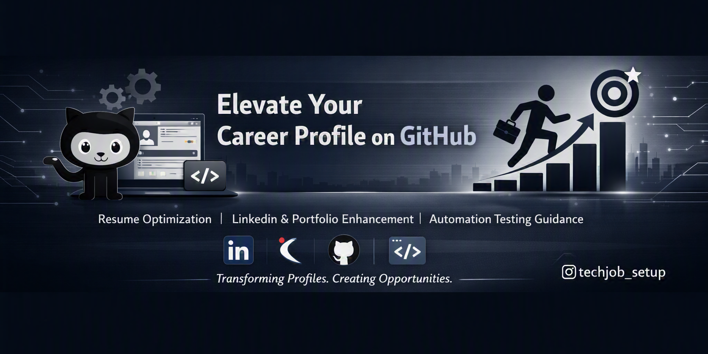

<div align="center">

# 🚀 Tech Job Setup

## Build a Standout Career Profile on GitHub, LinkedIn & Beyond

**Resume Optimization • Career Branding • Recruiter Positioning**



[](https://www.instagram.com/techjob_setup/)
[](https://www.instagram.com/techjob_setup/)
[](#)


</div>

---

## 👤 About

I help tech professionals **build a complete career identity** across GitHub, LinkedIn, and personal portfolios. My approach combines classical career strategies with modern visual branding to maximize recruiter visibility and career growth.

**Core Expertise:**
- 🔧 Resume & LinkedIn optimization
- 🎯 GitHub profile branding & README design
- 💻 C# automation engineering guidance (UI testing, API validation, desktop testing)
- 🌐 Portfolio website design & strategy

---

## 🎯 Services

<div align="center">

| Service | Description |
|---------|-------------|
| **🔗 LinkedIn Optimization** | Headline strategy, keyword mapping, featured content, recruiter targeting |
| **📋 Resume Enhancement** | ATS optimization, impact-driven bullet points, technical highlighting |
| **🐙 GitHub Profile Branding** | Premium README design, repo pinning strategy, technical showcase |
| **🖥️ Portfolio Development** | Clean, responsive design with recruiter-focused storytelling |
| **⚙️ Automation Engineering** | C# mentorship, testing frameworks, desktop & API automation |
| **💼 Naukri & Job Portals** | Complete profile setup, keyword strategy, ranking improvement |

</div>

---

## 📊 Delivery Process

```
DM Keyword → Profile Audit → Strategy Development → Build & Optimize → Launch & Monitor
```

**Simple workflow:** One message to get started. Keyword options: **PORTFOLIO** | **LINKEDIN** | **JOB**

---

## 💡 What You'll Get

✅ **Higher Recruiter Visibility** — Optimized profiles across all platforms  
✅ **Stronger Professional Brand** — Consistent messaging and visual identity  
✅ **Better Interview Opportunities** — Strategic keyword placement and positioning  
✅ **Technical Credibility** — Showcased projects and verified skills  
✅ **Actionable Guidance** — Personalized career mentorship  

---

## 🛠️ Tech Stack

**Languages & Frameworks:**  


**Tools & Platforms:**  


---

## 🚀 Quick Start

1. **Message on Instagram:** [@techjob_setup](https://www.instagram.com/techjob_setup/)
2. **Choose Your Focus:**
   - 🟣 **PORTFOLIO** — Build your online presence
   - 🔵 **LINKEDIN** — Optimize your profile
   - 🟢 **JOB** — Job search strategy
3. **Receive Personalized Strategy** — Based on your profile audit
4. **Get Implementation Support** — From design to deployment

---

## 📋 Career Guidance Topics

### For Automation Engineers
- ✅ C# fundamentals & advanced concepts
- ✅ UI test automation (Selenium, WinAppDriver)
- ✅ API testing & validation
- ✅ Desktop application testing
- ✅ Test framework design patterns
- ✅ CI/CD integration for tests

### For Profile Building
- ✅ GitHub profile optimization
- ✅ README design & storytelling
- ✅ Portfolio project selection
- ✅ Technical writing & documentation
- ✅ Open source contribution strategy

---

## 📬 Get Started

<div align="center">

### One Keyword Away From Career Growth

**Send a DM with:** PORTFOLIO • LINKEDIN • JOB

[](https://www.instagram.com/techjob_setup/)

**@techjob_setup • Hyderabad, Telangana 🇮🇳**

</div>

---

## 💬 Testimonials & Social

Follow on Instagram for daily career tips, optimization strategies, and success stories.  
**Let's build your standout tech career together!**

---

<div align="center">

**Last Updated:** September 2026 | Made with ❤️ for Career Growth

</div>
