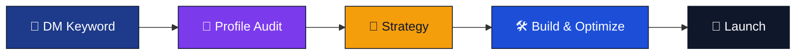

## 🌟 Build a Standout Career Profile on GitHub and Beyond

**Classical profile strategy • Modern visual branding • Recruiter-first positioning**

---

## 👤 About Me

I specialize in empowering candidates to build a complete career-oriented identity across `LinkedIn`, `GitHub`, and personal portfolios. My expertise includes resume optimization, profile enhancement, and strategic career guidance to ensure every detail reflects professional excellence. My mission is to transform ordinary profiles into interview-generating assets that capture the attention of recruiters and hiring managers.

In addition, I provide tailored career guidance for professionals pursuing roles as Automation Engineers. This includes mentoring on C# automation, UI testing, API validation, and desktop testing practices. By aligning technical expertise with industry expectations, I help candidates present themselves as highly skilled and market-ready professionals.

---

## 🏛️ Classical Services

<table>
  <tr>
    <td width="50%">💠 <strong>LinkedIn Optimization</strong> Headline architecture, recruiter keyword mapping, featured section setup, and visibility tuning.</td>
    <td width="50%">⚜️ <strong>Naukri & Job Portal Optimization</strong> Complete profile setup, role-aligned keyword strategy, and ranking improvements.</td>
  </tr>
  <tr>
    <td width="50%">🛡️ <strong>GitHub Profile Branding</strong> Premium `README`, pinned repository strategy, and technical showcase structure.</td>
    <td width="50%">✨ <strong>Portfolio Website Design</strong> Clean, mobile-responsive portfolio with recruiter-focused storytelling.</td>
  </tr>
  <tr>
    <td width="50%">⚙️ <strong>C# Automation Guidance</strong> C# fundamentals, UI testing, API validation, and desktop testing mentorship.</td>
    <td width="50%">🎯 <strong>Final Outcome</strong> Higher recruiter visibility, stronger trust, and improved interview opportunities.</td>
  </tr>
</table>

---

## 🧭 Delivery Flow

---

## 💻 Tech Stack & Tools

---

## 📬 Contact

### Start with one keyword

**🟣 PORTFOLIO** • **🔵 LINKEDIN** • **🟢 JOB**

<strong>@techjob_setup • Hyderabad, Telangana 🇮🇳</strong>

